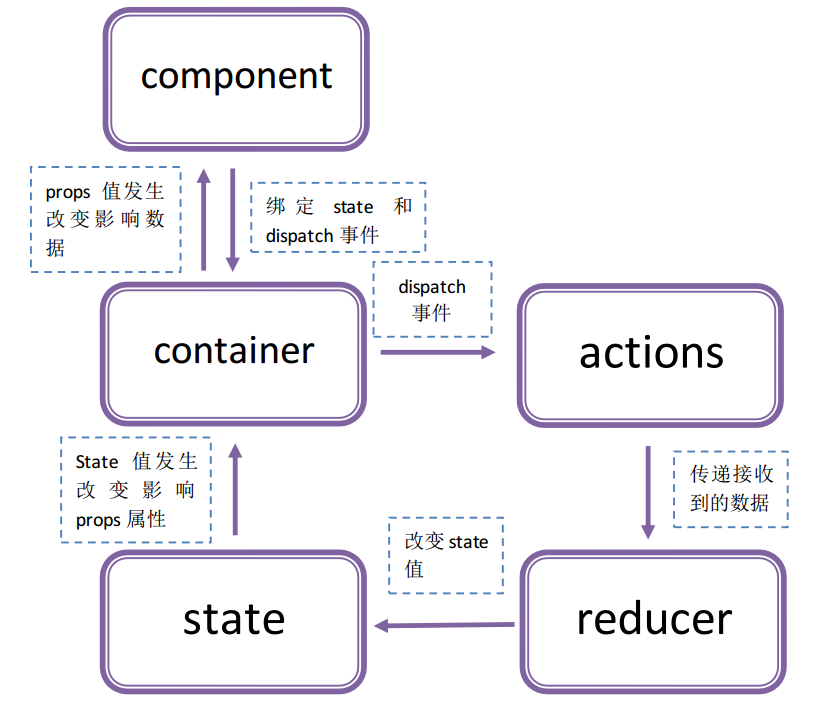

# 描述
  
  项目根据官网例子[todos](https://github.com/reactjs/redux/tree/master/examples/todos)改写而来，  
  去掉一些功能，根据自己的理解写的一个简单例子  
  
## react-redux

  从项目一我们知道，`react`组件间数据传递其实主要靠`props`属性，  
  如果组件藏的比较深，组件中还有组件，数据传递会相当麻烦,因此引入`redux`。
    
  个人理解：`react-redux`即将数据保存到全局`state`中(称之为store),需要使用数据的组件通过`connect`将数据作为`props`传入组件；  
  而全局的`state`只能通过`reducer`改变，`reducer`只有在接收到用户`dispatch`的事件时进行数据处理；  
  为了方便管理，`dispatch`的事件归类为`action`，并通过`connect`作为`props`传递到组件
  
## 流程

  
  
  
  
  
  
  
